# Architecture Diagrams: Agentic KYC System

**Feature**: 001-agentic-kyc-system  
**Version**: 1.0.0  
**Date**: 2025-11-12

This document contains comprehensive architecture and design diagrams for the AI-powered KYC system using Mermaid notation.

---

## Table of Contents

1. [System Context Diagram](#1-system-context-diagram)
2. [High-Level Architecture](#2-high-level-architecture)
3. [Component Architecture](#3-component-architecture)
4. [Data Flow Diagrams](#4-data-flow-diagrams)
5. [Agent Workflow Diagrams](#5-agent-workflow-diagrams)
6. [Database Schema Diagrams](#6-database-schema-diagrams)
7. [Deployment Architecture](#7-deployment-architecture)
8. [Sequence Diagrams](#8-sequence-diagrams)
9. [State Machine Diagrams](#9-state-machine-diagrams)
10. [Network Architecture](#10-network-architecture)

---

## 1. System Context Diagram

### 1.1 External Systems and Actors

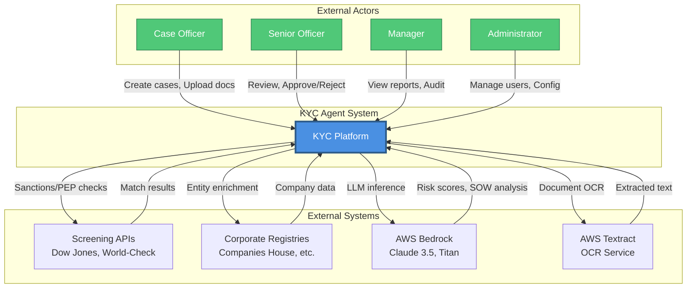

---

## 2. High-Level Architecture

### 2.1 Three-Tier Architecture

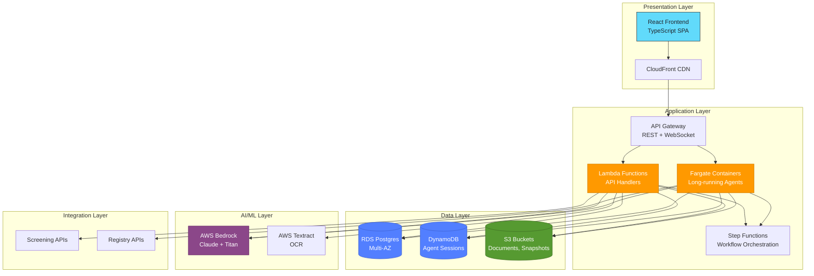

### 2.2 Microservices Architecture

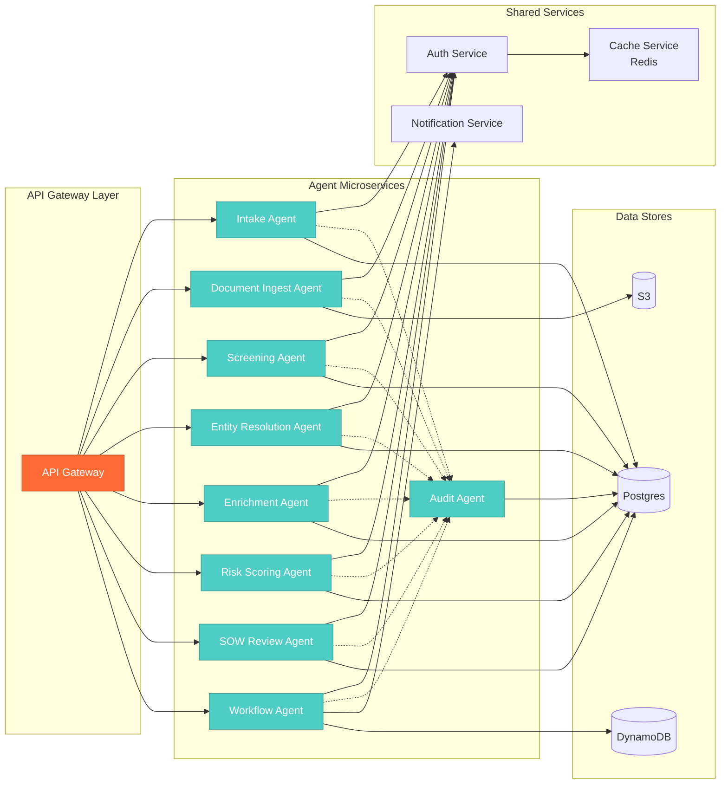

---

## 3. Component Architecture

### 3.1 Backend Component Diagram

```mermaid
graph TB
    subgraph "API Layer"
        ROUTES[FastAPI Routes<br/>/v1/cases, /v1/documents, etc.]
        WS[WebSocket Handler]
    end
    
    subgraph "Service Layer"
        CASE_SVC[CaseService]
        CLIENT_SVC[ClientService]
        DOC_SVC[DocumentService]
        SCREEN_SVC[ScreeningService]
        RISK_SVC[RiskService]
        SOW_SVC[SOWService]
        WORKFLOW_SVC[WorkflowService]
        AUDIT_SVC[AuditService]
    end
    
    subgraph "Agent Layer"
        AGENTS[LangGraph Agents<br/>Intake, Screening, Risk, SOW, etc.]
    end
    
    subgraph "Data Access Layer"
        MODELS[SQLAlchemy Models]
        REPOS[Repository Pattern]
    end
    
    subgraph "Integration Layer"
        BEDROCK_CLIENT[Bedrock Client]
        SCREEN_CLIENT[Screening API Client]
        REG_CLIENT[Registry API Client]
        TEXTRACT_CLIENT[Textract Client]
    end
    
    subgraph "Core Layer"
        AUTH[Authentication]
        CONFIG[Configuration]
        LOGGING[Logging & Tracing]
        VALIDATION[Pydantic Schemas]
    end
    
    ROUTES --> CASE_SVC
    ROUTES --> CLIENT_SVC
    ROUTES --> DOC_SVC
    ROUTES --> SCREEN_SVC
    ROUTES --> RISK_SVC
    ROUTES --> SOW_SVC
    ROUTES --> WORKFLOW_SVC
    
    WS --> WORKFLOW_SVC
    
    CASE_SVC --> AGENTS
    DOC_SVC --> AGENTS
    SCREEN_SVC --> AGENTS
    RISK_SVC --> AGENTS
    SOW_SVC --> AGENTS
    WORKFLOW_SVC --> AGENTS
    
    AGENTS --> BEDROCK_CLIENT
    AGENTS --> SCREEN_CLIENT
    AGENTS --> REG_CLIENT
    AGENTS --> TEXTRACT_CLIENT
    
    CASE_SVC --> REPOS
    CLIENT_SVC --> REPOS
    DOC_SVC --> REPOS
    SCREEN_SVC --> REPOS
    RISK_SVC --> REPOS
    SOW_SVC --> REPOS
    
    REPOS --> MODELS
    
    CASE_SVC -.-> AUDIT_SVC
    CLIENT_SVC -.-> AUDIT_SVC
    DOC_SVC -.-> AUDIT_SVC
    SCREEN_SVC -.-> AUDIT_SVC
    RISK_SVC -.-> AUDIT_SVC
    SOW_SVC -.-> AUDIT_SVC
    WORKFLOW_SVC -.-> AUDIT_SVC
    
    ROUTES --> AUTH
    ROUTES --> VALIDATION
    AGENTS --> LOGGING
    AGENTS --> CONFIG
    
    style ROUTES fill:#FF6B6B,stroke:#CC5656,color:#fff
    style CASE_SVC fill:#4ECDC4,stroke:#3AA39B,color:#fff
    style AGENTS fill:#95E1D3,stroke:#6BB8A5,color:#333
    style BEDROCK_CLIENT fill:#8B4789,stroke:#6B2F69,color:#fff
```

### 3.2 Frontend Component Diagram

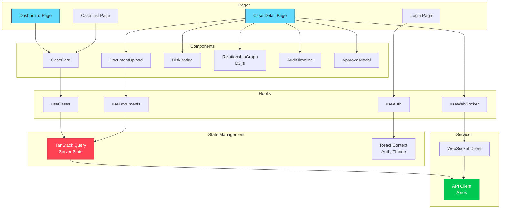

---

## 4. Data Flow Diagrams

### 4.1 Case Creation Flow

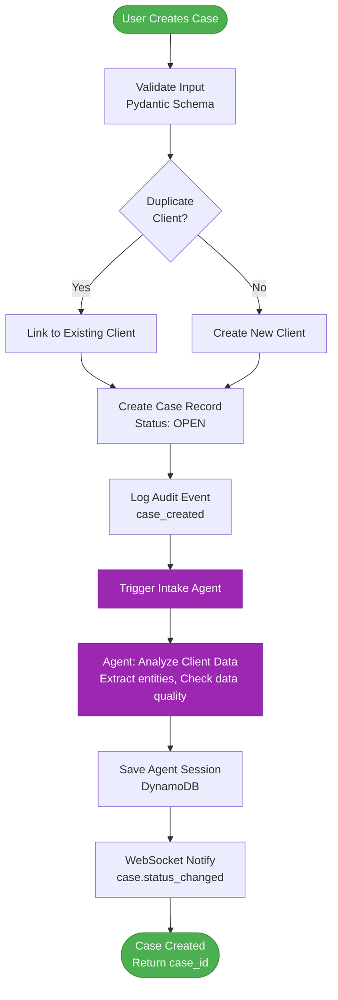

### 4.2 Document Processing Flow

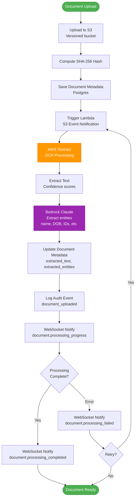

### 4.3 Screening Flow

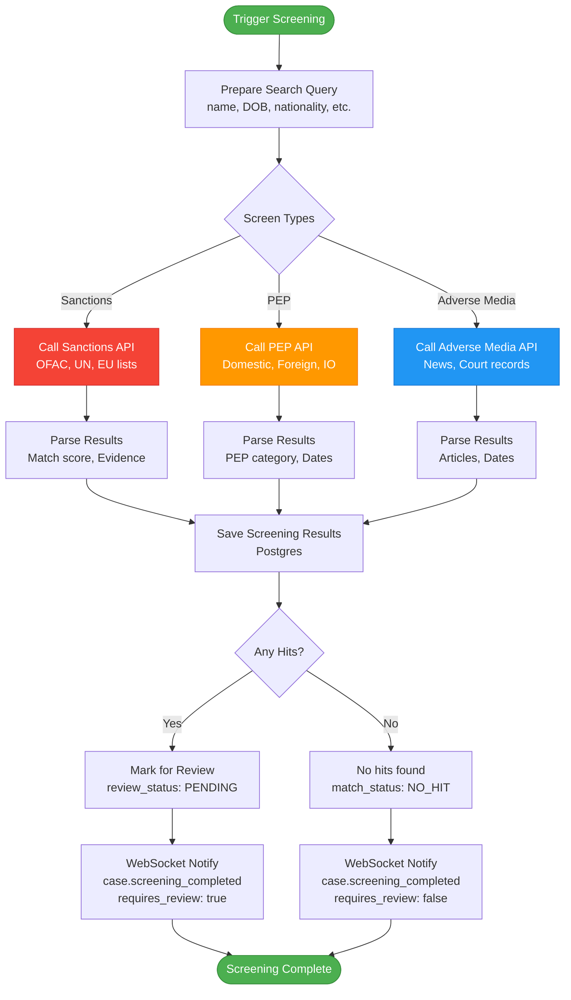

### 4.4 Risk Assessment Flow

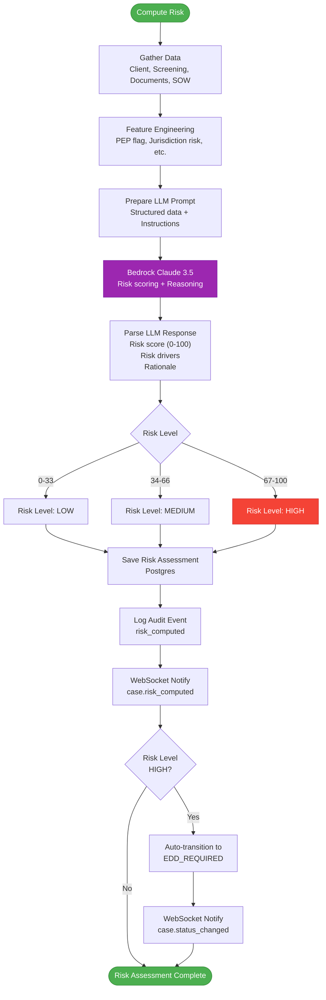

---

## 5. Agent Workflow Diagrams

### 5.1 LangGraph Agent State Machine

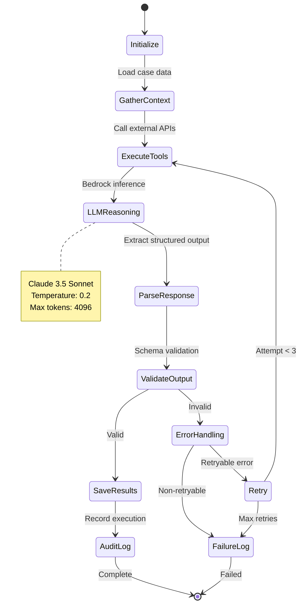

### 5.2 Entity Resolution Agent Workflow

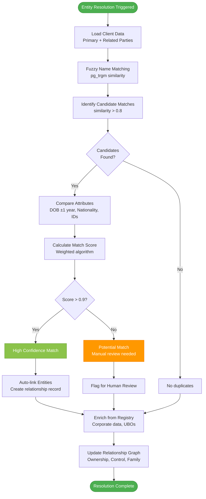

### 5.3 Source of Wealth Review Agent

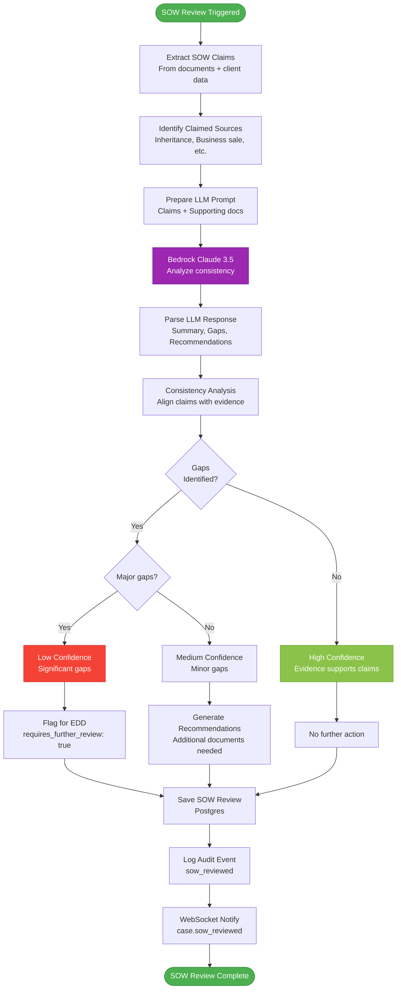

---

## 6. Database Schema Diagrams

### 6.1 Core Entity Relationships

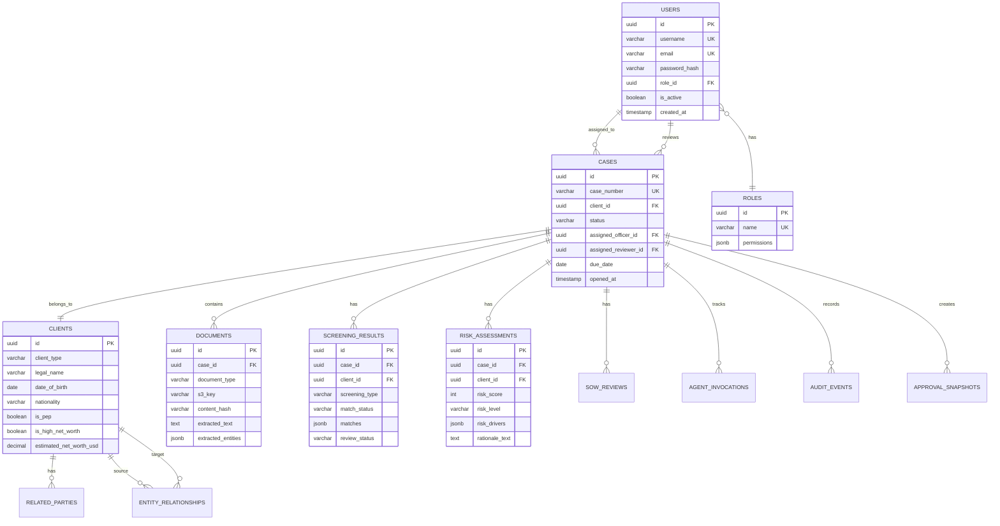

### 6.2 Audit and Compliance Schema

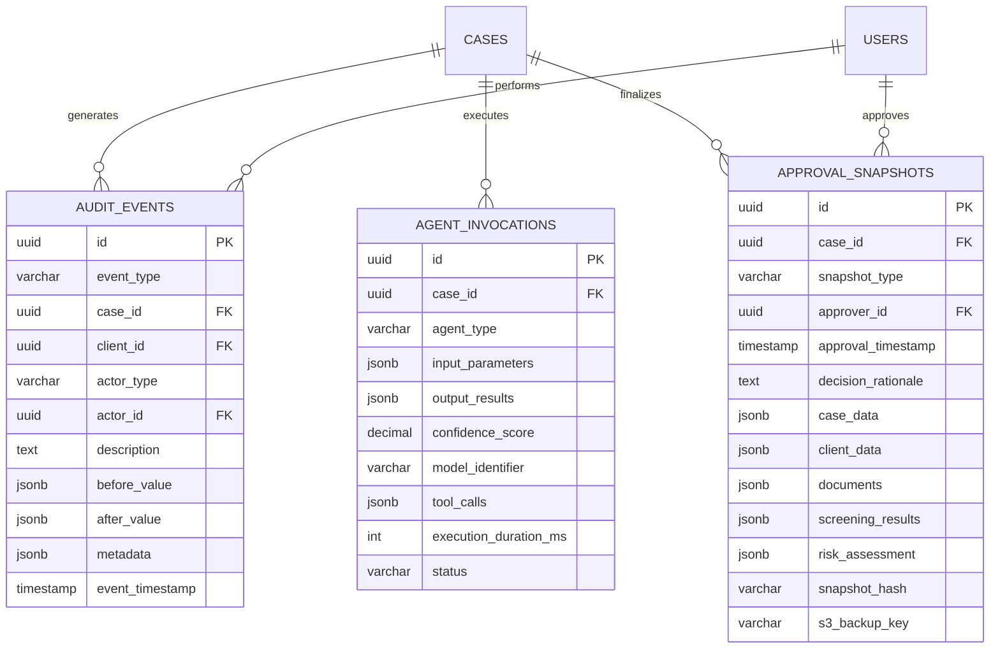

### 6.3 DynamoDB Table Design

```mermaid
graph TB
    subgraph "AgentSessions Table"
        PK1[PK: session_id]
        ATTR1[Attributes:<br/>case_id, agent_type, status,<br/>current_step, state, conversation_history]
        GSI1[GSI1: case_id + status]
        GSI2[GSI2: status + last_updated_at]
        TTL1[TTL: 30 days]
    end
    
    subgraph "EmbeddingsStore Table"
        PK2[PK: embedding_id]
        ATTR2[Attributes:<br/>entity_type, entity_id,<br/>embedding_vector[1536], text_content]
        GSI3[GSI1: entity_type + entity_id]
    end
    
    PK1 --> ATTR1
    ATTR1 --> GSI1
    ATTR1 --> GSI2
    ATTR1 --> TTL1
    
    PK2 --> ATTR2
    ATTR2 --> GSI3
    
    style PK1 fill:#FF9900,stroke:#CC7A00,color:#fff
    style PK2 fill:#FF9900,stroke:#CC7A00,color:#fff
    style GSI1 fill:#527FFF,stroke:#3D5FCC,color:#fff
    style GSI2 fill:#527FFF,stroke:#3D5FCC,color:#fff
    style GSI3 fill:#527FFF,stroke:#3D5FCC,color:#fff
```

---

## 7. Deployment Architecture

### 7.1 AWS Infrastructure

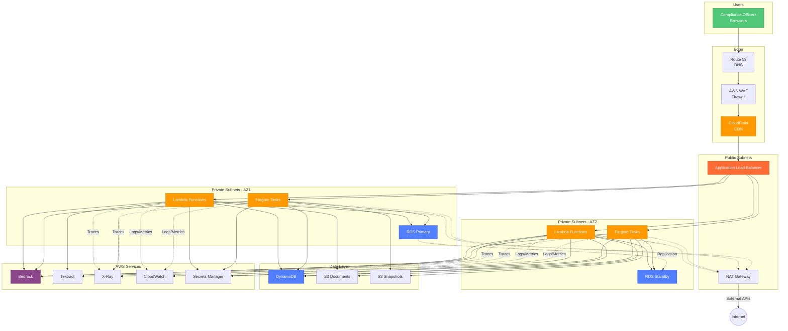

### 7.2 Multi-Environment Deployment

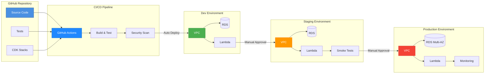

---

## 8. Sequence Diagrams

### 8.1 Case Approval Sequence

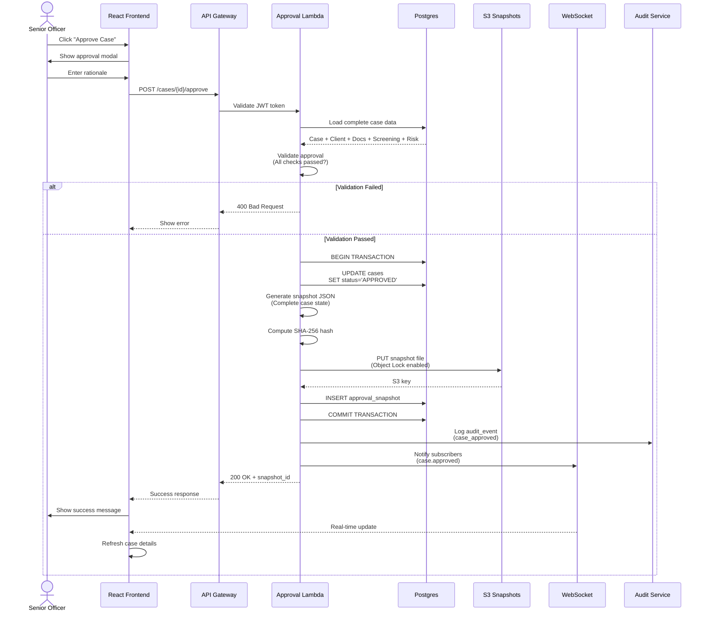

### 8.2 Document Upload and Processing

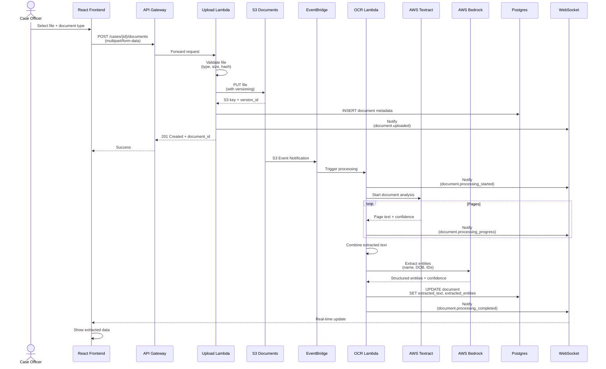

### 8.3 WebSocket Connection and Subscription

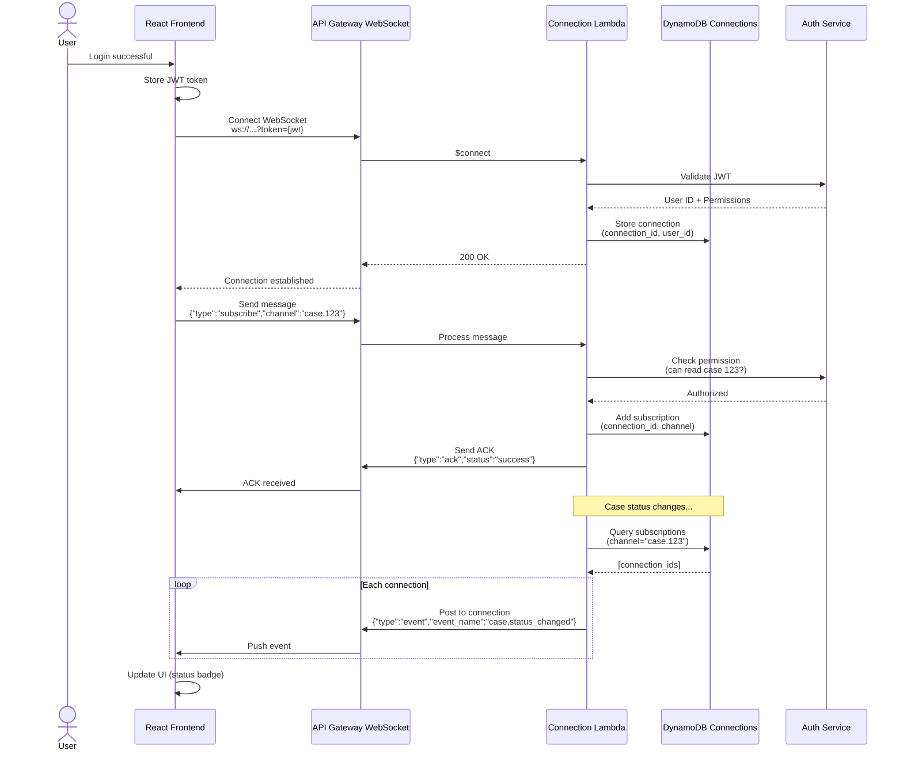

---

## 9. State Machine Diagrams

### 9.1 Case Status State Machine

```mermaid
stateDiagram-v2
    [*] --> OPEN: Case created
    
    OPEN --> UNDER_REVIEW: Officer starts review
    UNDER_REVIEW --> EDD_REQUIRED: High risk detected
    UNDER_REVIEW --> APPROVED: Senior Officer approves
    UNDER_REVIEW --> REJECTED: Senior Officer rejects
    
    EDD_REQUIRED --> UNDER_REVIEW: Additional docs submitted
    EDD_REQUIRED --> REJECTED: Cannot satisfy EDD
    
    APPROVED --> CLOSED: Case finalized
    REJECTED --> CLOSED: Case finalized
    
    CLOSED --> [*]
    
    note right of OPEN
        Initial state
        Documents can be uploaded
        Screening can be triggered
    end note
    
    note right of UNDER_REVIEW
        Assigned to reviewer
        Risk assessment computed
        SOW review generated
    end note
    
    note right of EDD_REQUIRED
        Enhanced Due Diligence
        Additional documentation required
        Manual investigation
    end note
    
    note right of APPROVED
        Creates immutable snapshot
        S3 Object Lock enabled
        7-year retention
    end note
```

### 9.2 Document Processing State Machine

```mermaid
stateDiagram-v2
    [*] --> UPLOADED: File uploaded to S3
    
    UPLOADED --> PROCESSING: Lambda triggered
    PROCESSING --> OCR_IN_PROGRESS: Textract started
    
    OCR_IN_PROGRESS --> EXTRACTING: Text extraction complete
    EXTRACTING --> ENTITY_EXTRACTION: LLM entity extraction
    
    ENTITY_EXTRACTION --> COMPLETED: Success
    ENTITY_EXTRACTION --> FAILED: Error
    
    FAILED --> RETRY: Retryable error
    RETRY --> PROCESSING: Attempt < 3
    RETRY --> PERMANENTLY_FAILED: Max retries
    
    COMPLETED --> [*]
    PERMANENTLY_FAILED --> [*]
    
    note right of PROCESSING
        WebSocket: processing_started
        Progress: 0%
    end note
    
    note right of OCR_IN_PROGRESS
        WebSocket: processing_progress
        Progress: 10-50%
    end note
    
    note right of ENTITY_EXTRACTION
        WebSocket: processing_progress
        Progress: 50-90%
    end note
    
    note right of COMPLETED
        WebSocket: processing_completed
        Progress: 100%
        extracted_text and entities saved
    end note
```

### 9.3 Screening Review State Machine

```mermaid
stateDiagram-v2
    [*] --> PENDING: Screening results received
    
    PENDING --> CONFIRMED: Officer confirms true positive
    PENDING --> FALSE_POSITIVE: Officer confirms false positive
    PENDING --> NEEDS_INVESTIGATION: Unclear, needs research
    
    NEEDS_INVESTIGATION --> CONFIRMED: Investigation confirms match
    NEEDS_INVESTIGATION --> FALSE_POSITIVE: Investigation clears
    
    CONFIRMED --> EDD_TRIGGERED: Auto-escalate case
    FALSE_POSITIVE --> CLEARED: No action needed
    
    EDD_TRIGGERED --> [*]
    CLEARED --> [*]
    
    note right of PENDING
        Requires human review
        Match score available
        Evidence URLs provided
    end note
    
    note right of CONFIRMED
        True positive match
        Triggers case escalation
        Logged in audit trail
    end note
    
    note right of FALSE_POSITIVE
        Not a real match
        Common name, etc.
        Rationale documented
    end note
```

---

## 10. Network Architecture

### 10.1 VPC Design

```mermaid
graph TB
    subgraph "AWS Cloud"
        subgraph "VPC 10.0.0.0/16"
            subgraph "Public Subnets"
                PUB_AZ1[Public Subnet AZ1<br/>10.0.1.0/24]
                PUB_AZ2[Public Subnet AZ2<br/>10.0.2.0/24]
                
                ALB[Application Load Balancer]
                NAT1[NAT Gateway AZ1]
                NAT2[NAT Gateway AZ2]
            end
            
            subgraph "Private Subnets - App Tier"
                PRIV_APP_AZ1[Private App AZ1<br/>10.0.10.0/24]
                PRIV_APP_AZ2[Private App AZ2<br/>10.0.11.0/24]
                
                LAMBDA1[Lambda Functions]
                LAMBDA2[Lambda Functions]
                FARGATE1[Fargate Tasks]
                FARGATE2[Fargate Tasks]
            end
            
            subgraph "Private Subnets - Data Tier"
                PRIV_DATA_AZ1[Private Data AZ1<br/>10.0.20.0/24]
                PRIV_DATA_AZ2[Private Data AZ2<br/>10.0.21.0/24]
                
                RDS_PRIMARY[(RDS Primary)]
                RDS_STANDBY[(RDS Standby)]
            end
        end
        
        IGW[Internet Gateway]
        
        subgraph "VPC Endpoints"
            S3_EP[S3 Gateway Endpoint]
            DDB_EP[DynamoDB Gateway Endpoint]
            BEDROCK_EP[Bedrock Interface Endpoint]
            SM_EP[Secrets Manager Endpoint]
        end
    end
    
    Internet((Internet)) --> IGW
    IGW --> PUB_AZ1
    IGW --> PUB_AZ2
    
    PUB_AZ1 --> ALB
    PUB_AZ2 --> ALB
    PUB_AZ1 --> NAT1
    PUB_AZ2 --> NAT2
    
    ALB --> PRIV_APP_AZ1
    ALB --> PRIV_APP_AZ2
    
    PRIV_APP_AZ1 --> LAMBDA1
    PRIV_APP_AZ1 --> FARGATE1
    PRIV_APP_AZ2 --> LAMBDA2
    PRIV_APP_AZ2 --> FARGATE2
    
    LAMBDA1 --> NAT1
    LAMBDA2 --> NAT2
    FARGATE1 --> NAT1
    FARGATE2 --> NAT2
    
    LAMBDA1 --> PRIV_DATA_AZ1
    LAMBDA2 --> PRIV_DATA_AZ2
    FARGATE1 --> PRIV_DATA_AZ1
    FARGATE2 --> PRIV_DATA_AZ2
    
    PRIV_DATA_AZ1 --> RDS_PRIMARY
    PRIV_DATA_AZ2 --> RDS_STANDBY
    
    RDS_PRIMARY -.Sync Replication.-> RDS_STANDBY
    
    LAMBDA1 --> S3_EP
    LAMBDA2 --> S3_EP
    LAMBDA1 --> DDB_EP
    LAMBDA2 --> DDB_EP
    LAMBDA1 --> BEDROCK_EP
    LAMBDA2 --> BEDROCK_EP
    LAMBDA1 --> SM_EP
    LAMBDA2 --> SM_EP
    
    style PUB_AZ1 fill:#FFE5B4,stroke:#FFA500,color:#333
    style PUB_AZ2 fill:#FFE5B4,stroke:#FFA500,color:#333
    style PRIV_APP_AZ1 fill:#B4D7FF,stroke:#4A90E2,color:#333
    style PRIV_APP_AZ2 fill:#B4D7FF,stroke:#4A90E2,color:#333
    style PRIV_DATA_AZ1 fill:#D4EDDA,stroke:#28A745,color:#333
    style PRIV_DATA_AZ2 fill:#D4EDDA,stroke:#28A745,color:#333
```

### 10.2 Security Groups

```mermaid
graph TB
    subgraph "Security Groups"
        SG_ALB[ALB Security Group<br/>Ingress: 443 from Internet<br/>Egress: All to App SG]
        
        SG_APP[Application Security Group<br/>Ingress: 8000 from ALB SG<br/>Egress: All to Data SG, VPC Endpoints]
        
        SG_DATA[Database Security Group<br/>Ingress: 5432 from App SG<br/>Egress: None]
        
        SG_VPC_EP[VPC Endpoint Security Group<br/>Ingress: 443 from App SG<br/>Egress: None]
    end
    
    Internet((Internet)) -->|HTTPS 443| SG_ALB
    SG_ALB -->|HTTP 8000| SG_APP
    SG_APP -->|PostgreSQL 5432| SG_DATA
    SG_APP -->|HTTPS 443| SG_VPC_EP
    
    style SG_ALB fill:#FF6B6B,stroke:#CC5656,color:#fff
    style SG_APP fill:#4ECDC4,stroke:#3AA39B,color:#fff
    style SG_DATA fill:#95E1D3,stroke:#6BB8A5,color:#333
    style SG_VPC_EP fill:#F38181,stroke:#C25E5E,color:#fff
```

### 10.3 Data Flow Security

```mermaid
flowchart LR
    subgraph "Edge Security"
        WAF[AWS WAF<br/>Rate limiting, SQL injection, XSS]
        SHIELD[AWS Shield<br/>DDoS protection]
    end
    
    subgraph "Application Security"
        JWT[JWT Validation<br/>HMAC-SHA256]
        RBAC[Role-Based Access Control<br/>4 roles, granular permissions]
        RATE[Rate Limiting<br/>API Gateway throttling]
    end
    
    subgraph "Data Security"
        ENC_TRANSIT[TLS 1.3<br/>In-transit encryption]
        ENC_REST[KMS Encryption<br/>At-rest encryption]
        MASKING[PII Masking<br/>Log redaction]
    end
    
    subgraph "Secrets Management"
        SM[Secrets Manager<br/>Auto-rotation]
        IAM[IAM Roles<br/>Least privilege]
    end
    
    WAF --> JWT
    SHIELD --> JWT
    JWT --> RBAC
    RBAC --> RATE
    
    RATE --> ENC_TRANSIT
    ENC_TRANSIT --> ENC_REST
    ENC_REST --> MASKING
    
    JWT -.Uses.-> SM
    RBAC -.Enforced by.-> IAM
    
    style WAF fill:#F44336,stroke:#D32F2F,color:#fff
    style JWT fill:#4CAF50,stroke:#388E3C,color:#fff
    style ENC_TRANSIT fill:#2196F3,stroke:#1976D2,color:#fff
    style ENC_REST fill:#9C27B0,stroke:#7B1FA2,color:#fff
    style SM fill:#FF9800,stroke:#F57C00,color:#fff
```

---

## Summary

This document provides comprehensive visual documentation of the KYC Agent System architecture across multiple dimensions:

- **System Context**: External actors, systems, and integrations
- **Architecture**: Three-tier, microservices, component diagrams
- **Data Flow**: Case creation, document processing, screening, risk assessment
- **Agent Workflows**: LangGraph state machines, entity resolution, SOW review
- **Database**: ER diagrams, schema relationships, DynamoDB design
- **Deployment**: AWS infrastructure, multi-environment CI/CD
- **Sequences**: Approval flows, document processing, WebSocket subscriptions
- **State Machines**: Case status, document processing, screening review
- **Network**: VPC design, security groups, data flow security

**Usage**: Reference these diagrams during:
- Architecture reviews
- Technical onboarding
- System design discussions
- Troubleshooting and debugging
- Documentation updates
- Stakeholder presentations

**Maintenance**: Update diagrams when:
- Adding new microservices
- Changing data flows
- Modifying infrastructure
- Introducing new integrations
- Refactoring components

---

**Last Updated**: 2025-11-12  
**Version**: 1.0.0  
**Branch**: `001-agentic-kyc-system`
